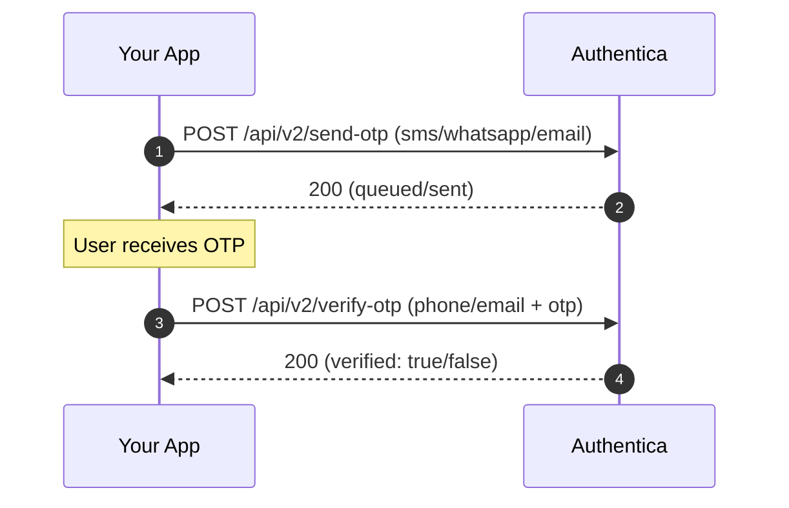
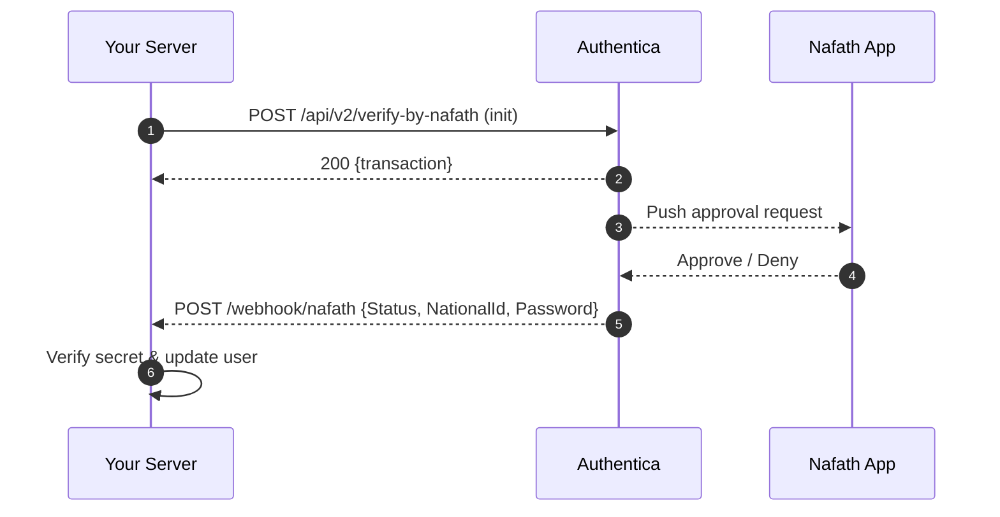
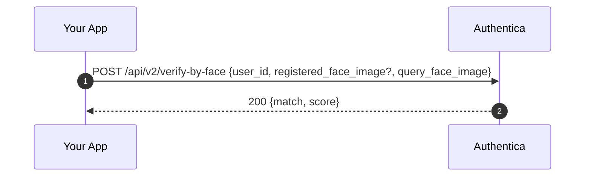
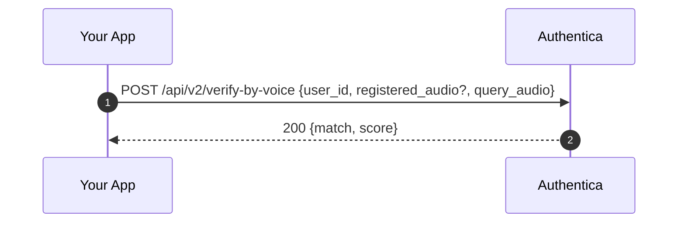
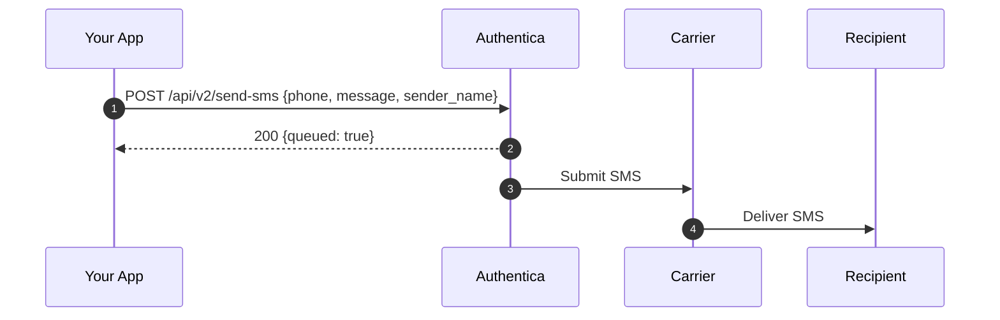
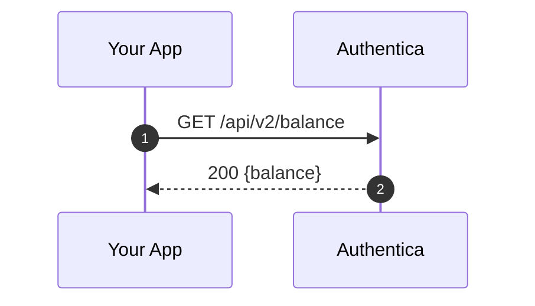

# Authentica API — Developer Journey & Examples (Docs‑first)

A single page you can **read on GitHub** and immediately understand how to integrate **Authentica**:

* **OTP** via **SMS / WhatsApp / Email**
* **Nafath** (Saudi digital identity) — *enablement required*
* **Biometrics**: **Face** & **Voice** verification
* **Custom SMS** and **Balance** checks

> This README includes **minimal, commented Node.js & Python snippets**. Full, runnable scripts live in `/examples/` (also readable inline on GitHub). Cloning is **optional**.

---

## How to use this page

1. Skim **Before you start** (headers, formats, optional env names).
2. Pick a flow (OTP, Nafath, Face, Voice, SMS, Balance).
3. Copy a **Node** or **Python** snippet as your starting point.
4. If you want a runnable script, click the file under **Examples Index**.

---

## Repository map (what exists in this repo)

```
authentica-documentation/
├─ README.md                     # You are here
├─ docs/                         # Short, focused deep dives (optional reading)
│  ├─ otp.md
│  ├─ nafath.md
│  ├─ face.md
│  ├─ voice.md
│  ├─ custom-sms.md
│  └─ webhooks.md
├─ examples/
│  ├─ node/
│  │  ├─ otp_send.js            # tiny, commented scripts
│  │  ├─ otp_verify.js
│  │  ├─ nafath_server.js       # Express init + webhook
│  │  ├─ face_verify.js
│  │  ├─ voice_verify.js
│  │  ├─ custom_sms.js
│  │  └─ balance.js
│  └─ python/
│     ├─ otp_send.py
│     ├─ otp_verify.py
│     ├─ nafath_server.py       # FastAPI init + webhook
│     ├─ face_verify.py
│     ├─ voice_verify.py
│     ├─ custom_sms.py
│     └─ balance.py
└─ LICENSE
```

### Examples Index (click to read code inline on GitHub)

| Feature                 | Node.js file                                                      | Python file                                                           |
| ----------------------- | ----------------------------------------------------------------- | --------------------------------------------------------------------- |
| OTP — Send              | [examples/node/otp\_send.js](examples/node/otp_send.js)           | [examples/python/otp\_send.py](examples/python/otp_send.py)           |
| OTP — Verify            | [examples/node/otp\_verify.js](examples/node/otp_verify.js)       | [examples/python/otp\_verify.py](examples/python/otp_verify.py)       |
| Nafath (init + webhook) | [examples/node/nafath\_server.js](examples/node/nafath_server.js) | [examples/python/nafath\_server.py](examples/python/nafath_server.py) |
| Face verify             | [examples/node/face\_verify.js](examples/node/face_verify.js)     | [examples/python/face\_verify.py](examples/python/face_verify.py)     |
| Voice verify            | [examples/node/voice\_verify.js](examples/node/voice_verify.js)   | [examples/python/voice\_verify.py](examples/python/voice_verify.py)   |
| Custom SMS              | [examples/node/custom\_sms.js](examples/node/custom_sms.js)       | [examples/python/custom\_sms.py](examples/python/custom_sms.py)       |
| Balance                 | [examples/node/balance.js](examples/node/balance.js)              | [examples/python/balance.py](examples/python/balance.py)              |

> Every example is intentionally short and commented. Use them as runnable references; no boilerplate frameworks beyond `express` (Node) and `fastapi/requests` (Python) where needed.

---

## Before you start

**Base URL**

```
https://api.authentica.sa
```

**Auth header**

```
X-Authorization: YOUR_API_KEY
```

**JSON headers**

```
Accept: application/json
Content-Type: application/json
```

**Formats & notes**

* Phone numbers: **E.164** (e.g., `+9665XXXXXXXX`).
* Face/Voice media: **base64** strings (avoid logging in production).
* Timeouts/retries: treat all calls as network I/O; add retries with jitter in your app if needed.

**Nafath**

> ⚠️ Requires account **enablement** and may have **separate pricing**. Contact Authentica to enable before testing.

**Optional environment variables** (used by examples; not required to understand the README)

```
AUTHENTICA_API_KEY=your_api_key
BASE_URL=https://api.authentica.sa
WEBHOOK_PASSWORD=choose-a-strong-secret   # for webhook verification
```

---

## OTP: Send & Verify

**Use for**: Login, 2FA, passwordless, recovery.

#### Flow (Mermaid renders on GitHub)



### Node — Send OTP (choose channel)

```js
// sendOtp('sms', '+9665XXXXXXXX')  or  sendOtp('email', 'user@example.com')
async function sendOtp(method, recipient) {
  const BASE_URL = process.env.BASE_URL || 'https://api.authentica.sa';
  const API_KEY  = process.env.AUTHENTICA_API_KEY || 'YOUR_API_KEY';
  const body = method === 'email' ? { method, email: recipient } : { method, phone: recipient };
  const res = await fetch(`${BASE_URL}/api/v2/send-otp`, {
    method: 'POST',
    headers: { 'Accept':'application/json','Content-Type':'application/json','X-Authorization': API_KEY },
    body: JSON.stringify(body)
  });
  const json = await res.json();
  if (!res.ok) throw new Error(JSON.stringify(json));
  return json; // { success: true, ... }
}
```

### Python — Send OTP

```python
# send_otp('sms', '+9665XXXXXXXX')  or  send_otp('email', 'user@example.com')
import os, json, requests

def send_otp(method: str, recipient: str):
    BASE_URL = os.getenv('BASE_URL','https://api.authentica.sa')
    API_KEY  = os.getenv('AUTHENTICA_API_KEY','YOUR_API_KEY')
    body = {'method': method, ('email' if method=='email' else 'phone'): recipient}
    r = requests.post(f"{BASE_URL}/api/v2/send-otp",
        headers={'Accept':'application/json','Content-Type':'application/json','X-Authorization':API_KEY},
        data=json.dumps(body))
    j = r.json()
    if not r.ok: raise Exception(j)
    return j
```

### Node — Verify OTP

```js
// verifyOtp('+9665XXXXXXXX', '123456')  or  verifyOtp('user@example.com','123456')
async function verifyOtp(recipient, otp) {
  const BASE_URL = process.env.BASE_URL || 'https://api.authentica.sa';
  const API_KEY  = process.env.AUTHENTICA_API_KEY || 'YOUR_API_KEY';
  const body = recipient.includes('@') ? { email: recipient, otp } : { phone: recipient, otp };
  const res = await fetch(`${BASE_URL}/api/v2/verify-otp`, {
    method: 'POST',
    headers: { 'Accept':'application/json','Content-Type':'application/json','X-Authorization': API_KEY },
    body: JSON.stringify(body)
  });
  const json = await res.json();
  if (!res.ok) throw new Error(JSON.stringify(json));
  return json; // { verified: true }
}
```

### Python — Verify OTP

```python
# verify_otp('+9665XXXXXXXX', '123456')  or  verify_otp('user@example.com','123456')
import os, json, requests

def verify_otp(recipient: str, otp: str):
    BASE_URL = os.getenv('BASE_URL','https://api.authentica.sa')
    API_KEY  = os.getenv('AUTHENTICA_API_KEY','YOUR_API_KEY')
    body = {'otp': otp}
    body['email' if '@' in recipient else 'phone'] = recipient
    r = requests.post(f"{BASE_URL}/api/v2/verify-otp",
        headers={'Accept':'application/json','Content-Type':'application/json','X-Authorization':API_KEY},
        data=json.dumps(body))
    j = r.json()
    if not r.ok: raise Exception(j)
    return j
```

---

## Nafath: Initiate & Webhook

**Use for**: High‑assurance KYC using Saudi digital identity.

> **Enablement required**: Nafath is not enabled by default and may incur separate charges. Contact Authentica to enable it.

#### Flow (Mermaid renders on GitHub)



### Node — Minimal Nafath server (init + webhook)

```js
// Express server: initiate Nafath + receive webhook
import 'dotenv/config';
import express from 'express';
const app = express(); app.use(express.json());
const BASE_URL = process.env.BASE_URL || 'https://api.authentica.sa';
const API_KEY  = process.env.AUTHENTICA_API_KEY || 'YOUR_API_KEY';
const SECRET   = process.env.WEBHOOK_PASSWORD || 'your-secure-password';

app.post('/nafath/init', async (req, res) => {
  const r = await fetch(`${BASE_URL}/api/v2/verify-by-nafath`, {
    method: 'POST',
    headers: { 'Accept':'application/json','Content-Type':'application/json','X-Authorization': API_KEY },
    body: JSON.stringify({ user_id: req.body?.user_id || 'demo-user' })
  });
  res.status(r.status).json(await r.json());
});

app.post('/webhook/nafath', (req, res) => {
  if (req.body?.Password !== SECRET) return res.sendStatus(401);
  console.log('Nafath:', req.body?.Status, 'NID:', req.body?.NationalId);
  res.sendStatus(200);
});

app.listen(3000, () => console.log('Nafath demo on http://localhost:3000'));
```

### Python — Minimal Nafath server (FastAPI)

```python
# FastAPI server: initiate Nafath + receive webhook
import os, json, requests
from fastapi import FastAPI, Request, HTTPException
app = FastAPI()
BASE_URL = os.getenv('BASE_URL','https://api.authentica.sa')
API_KEY  = os.getenv('AUTHENTICA_API_KEY','YOUR_API_KEY')
SECRET   = os.getenv('WEBHOOK_PASSWORD','your-secure-password')

@app.post('/nafath/init')
def nafath_init(payload: dict):
    r = requests.post(f"{BASE_URL}/api/v2/verify-by-nafath",
        headers={'Accept':'application/json','Content-Type':'application/json','X-Authorization':API_KEY},
        data=json.dumps({'user_id': payload.get('user_id','demo-user')}))
    return {'status': r.status_code, 'json': r.json()}

@app.post('/webhook/nafath')
async def nafath_webhook(req: Request):
    data = await req.json()
    if data.get('Password') != SECRET:
        raise HTTPException(status_code=401, detail='Invalid secret')
    print('Nafath:', data.get('Status'), 'NID:', data.get('NationalId'))
    return {'ok': True}
```

---

## Face Verification

**Use for**: Step‑up checks (account recovery, high‑risk actions).

#### Flow (Mermaid renders on GitHub)



### Node — Verify by face (base64 images)

```js
async function verifyByFace(refBase64, queryBase64) {
  const BASE_URL = process.env.BASE_URL || 'https://api.authentica.sa';
  const API_KEY  = process.env.AUTHENTICA_API_KEY || 'YOUR_API_KEY';
  const res = await fetch(`${BASE_URL}/api/v2/verify-by-face`, {
    method: 'POST',
    headers: { 'Accept':'application/json','Content-Type':'application/json','X-Authorization': API_KEY },
    body: JSON.stringify({ user_id: 'demo', registered_face_image: refBase64, query_face_image: queryBase64 })
  });
  const json = await res.json();
  if (!res.ok) throw new Error(JSON.stringify(json));
  return json; // expect match info/score
}
```

### Python — Verify by face

```python
import os, json, requests

def verify_by_face(ref_b64: str, query_b64: str):
    BASE_URL = os.getenv('BASE_URL','https://api.authentica.sa')
    API_KEY  = os.getenv('AUTHENTICA_API_KEY','YOUR_API_KEY')
    r = requests.post(f"{BASE_URL}/api/v2/verify-by-face",
        headers={'Accept':'application/json','Content-Type':'application/json','X-Authorization':API_KEY},
        data=json.dumps({'user_id':'demo','registered_face_image':ref_b64,'query_face_image':query_b64}))
    j = r.json()
    if not r.ok: raise Exception(j)
    return j
```

---

## Voice Verification

**Use for**: High‑assurance checks, hands‑free flows.

#### Flow (Mermaid renders on GitHub)



### Node — Verify by voice (base64 audio)

```js
async function verifyByVoice(refBase64, queryBase64) {
  const BASE_URL = process.env.BASE_URL || 'https://api.authentica.sa';
  const API_KEY  = process.env.AUTHENTICA_API_KEY || 'YOUR_API_KEY';
  const res = await fetch(`${BASE_URL}/api/v2/verify-by-voice`, {
    method: 'POST',
    headers: { 'Accept':'application/json','Content-Type':'application/json','X-Authorization': API_KEY },
    body: JSON.stringify({ user_id: 'demo', registered_audio: refBase64, query_audio: queryBase64 })
  });
  const json = await res.json();
  if (!res.ok) throw new Error(JSON.stringify(json));
  return json; // expect match info/score
}
```

### Python — Verify by voice

```python
import os, json, requests

def verify_by_voice(ref_b64: str, query_b64: str):
    BASE_URL = os.getenv('BASE_URL','https://api.authentica.sa')
    API_KEY  = os.getenv('AUTHENTICA_API_KEY','YOUR_API_KEY')
    r = requests.post(f"{BASE_URL}/api/v2/verify-by-voice",
        headers={'Accept':'application/json','Content-Type':'application/json','X-Authorization':API_KEY},
        data=json.dumps({'user_id':'demo','registered_audio':ref_b64,'query_audio':query_b64}))
    j = r.json()
    if not r.ok: raise Exception(j)
    return j
```

---

## Custom SMS

**Use for**: Non‑OTP notifications with a **registered sender name**.

#### Flow (Mermaid renders on GitHub)



### Node — Send custom SMS

```js
async function sendCustomSms(phone, message, senderName) {
  const BASE_URL = process.env.BASE_URL || 'https://api.authentica.sa';
  const API_KEY  = process.env.AUTHENTICA_API_KEY || 'YOUR_API_KEY';
  const res = await fetch(`${BASE_URL}/api/v2/send-sms`, {
    method: 'POST',
    headers: { 'Accept':'application/json','Content-Type':'application/json','X-Authorization': API_KEY },
    body: JSON.stringify({ phone, message, sender_name: senderName })
  });
  const json = await res.json();
  if (!res.ok) throw new Error(JSON.stringify(json));
  return json; // queued
}
```

### Python — Send custom SMS

```python
import os, json, requests

def send_custom_sms(phone: str, message: str, sender_name: str):
    BASE_URL = os.getenv('BASE_URL','https://api.authentica.sa')
    API_KEY  = os.getenv('AUTHENTICA_API_KEY','YOUR_API_KEY')
    r = requests.post(f"{BASE_URL}/api/v2/send-sms",
        headers={'Accept':'application/json','Content-Type':'application/json','X-Authorization':API_KEY},
        data=json.dumps({'phone':phone,'message':message,'sender_name':sender_name}))
    j = r.json()
    if not r.ok: raise Exception(j)
    return j
```

---

## Balance

#### Flow (Mermaid renders on GitHub)



### Node — Check balance

```js
async function checkBalance() {
    const BASE_URL = process.env.BASE_URL || 'https://api.authentica.sa';
    const API_KEY  = process.env.AUTHENTICA_API_KEY || 'YOUR_API_KEY';
    const res = await fetch(`${BASE_URL}/api/v2/balance`, {
        headers: { 'Accept':'application/json','X-Authorization': API_KEY }
    });
    const json = await res.json();
    if (!res.ok) throw new Error(JSON.stringify(json));
    return json; // e.g., { data: { balance: 21934 } }
}
```

### Python — Check balance

```python
import os, requests

def check_balance():
    BASE_URL = os.getenv('BASE_URL','https://api.authentica.sa')
    API_KEY  = os.getenv('AUTHENTICA_API_KEY','YOUR_API_KEY')
    r = requests.get(f"{BASE_URL}/api/v2/balance",
        headers={'Accept':'application/json','X-Authorization':API_KEY})
    j = r.json()
    if not r.ok: raise Exception(j)
    return j
```

---

## Webhooks (general)

* Expose a **POST** endpoint (e.g., `/webhook/nafath`).
* **Verify** a shared secret/password from the payload; reject if missing/invalid.
* For local testing, use **cloudflared** or **ngrok** to create a public URL.
* Consider **replay protection** (timestamps/nonces) and **IP allowlists**.

---

## Security & Best Practices

* Never log **PII** (full phone/email) or **base64 media**.
* Store reference **face/voice** media **encrypted at rest**; obtain explicit user consent.
* Validate **webhooks** and handle failures idempotently.
* Enforce **E.164** phone formatting.
* Map common error codes (400 invalid params, 401 bad key, 429 rate limits) to actionable messages.

---

## Troubleshooting

* **401 Unauthorized** → Check `X-Authorization` and account status in the portal.
* **OTP not delivered** → Confirm E.164, correct channel, registered sender (SMS), and carrier coverage.
* **Face/Voice mismatch** → Improve sample quality; ensure correct base64 and consistent formats.
* **No webhook** → Verify public URL, firewall, and secret/password validation.

---

## Useful Links & Contact

* Website: [https://authentica.sa](https://authentica.sa)
* API Docs: [https://authenticasa.docs.apiary.io/#reference](https://authenticasa.docs.apiary.io/#reference)
* Portal/Dashboard: [https://portal.authentica.sa/](https://portal.authentica.sa/)
* Support / Sales: **[support@your-company.com](mailto:support@your-company.com)** *(replace with your real contact)*