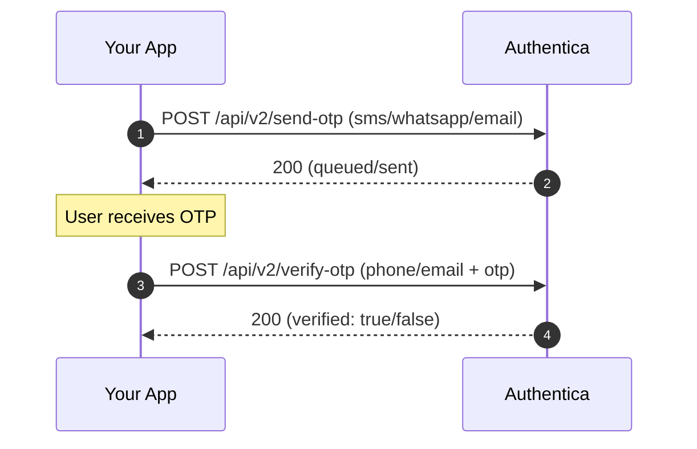

# OTP (SMS / WhatsApp / Email)

Use OTP for login, 2FA, passwordless, and account recovery flows. This page gives you **copy‑pasteable**, minimal code in **Node.js** and **Python**—no cURL.

---

## Endpoints used

* **POST** `/api/v2/send-otp` — send a one‑time code via `sms`, `whatsapp`, or `email`
* **POST** `/api/v2/verify-otp` — verify a code with `phone` **or** `email` + `otp`

> **Auth header:** `X-Authorization: YOUR_API_KEY`
> **Base URL:** `https://api.authentica.sa`
> **JSON headers:** `Accept: application/json`, `Content-Type: application/json`

---

## Required fields

* For **SMS/WhatsApp**: `phone` in **E.164** (e.g., `+9665XXXXXXXX`)
* For **Email**: `email` (and **omit** `phone`)
* `otp` is only required in the **verify** call

---

## Quick sequence



---

## Node.js — tiny helpers

```js
// otp.js — minimal helpers (Node 18+ with global fetch)
const BASE_URL = process.env.BASE_URL || 'https://api.authentica.sa';
const API_KEY  = process.env.AUTHENTICA_API_KEY || 'YOUR_API_KEY';

export async function otpSend(method, recipient) {
  // method: 'sms' | 'whatsapp' | 'email'
  const body = method === 'email' ? { method, email: recipient } : { method, phone: recipient };
  const r = await fetch(`${BASE_URL}/api/v2/send-otp`, {
    method: 'POST',
    headers: {
      'Accept': 'application/json',
      'Content-Type': 'application/json',
      'X-Authorization': API_KEY,
    },
    body: JSON.stringify(body),
  });
  const j = await r.json();
  if (!r.ok) throw new Error(JSON.stringify(j));
  return j; // { success: true, ... }
}

export async function otpVerify(recipient, otp) {
  const body = recipient.includes('@') ? { email: recipient, otp } : { phone: recipient, otp };
  const r = await fetch(`${BASE_URL}/api/v2/verify-otp`, {
    method: 'POST',
    headers: {
      'Accept': 'application/json',
      'Content-Type': 'application/json',
      'X-Authorization': API_KEY,
    },
    body: JSON.stringify(body),
  });
  const j = await r.json();
  if (!r.ok) throw new Error(JSON.stringify(j));
  return j; // { verified: true }
}

// Example usage:
// await otpSend('sms', '+9665XXXXXXXX');
// const result = await otpVerify('+9665XXXXXXXX', '123456');
```

---

## Python — tiny helpers

```python
# otp.py — minimal helpers
import os, json, requests

BASE_URL = os.getenv('BASE_URL', 'https://api.authentica.sa')
API_KEY  = os.getenv('AUTHENTICA_API_KEY', 'YOUR_API_KEY')
HEADERS  = {
    'Accept': 'application/json',
    'Content-Type': 'application/json',
    'X-Authorization': API_KEY,
}

def otp_send(method: str, recipient: str):
    """method: 'sms' | 'whatsapp' | 'email'"""
    body = {'method': method}
    if method == 'email':
        body['email'] = recipient
    else:
        body['phone'] = recipient
    r = requests.post(f"{BASE_URL}/api/v2/send-otp", headers=HEADERS, data=json.dumps(body))
    j = r.json()
    if not r.ok:
        raise Exception(j)
    return j


def otp_verify(recipient: str, otp: str):
    body = {'otp': otp}
    if '@' in recipient:
        body['email'] = recipient
    else:
        body['phone'] = recipient
    r = requests.post(f"{BASE_URL}/api/v2/verify-otp", headers=HEADERS, data=json.dumps(body))
    j = r.json()
    if not r.ok:
        raise Exception(j)
    return j

# Example usage:
# otp_send('sms', '+9665XXXXXXXX')
# res = otp_verify('+9665XXXXXXXX', '123456')
```

---

## Pitfalls & tips

* **Channel ↔ field mismatch**: for `email` method, send `email`; for `sms`/`whatsapp`, send `phone`.
* **Phone formatting**: must be **E.164** (e.g., `+9665…`).
* **Retries**: handle transient network issues (exponential backoff). Avoid resending OTP too quickly.
* **PII & logs**: never log full phone/email or OTP values in production.

---

## See also

* Main README sections: *OTP: Send & Verify*
* Related: `docs/webhooks.md` (for flows that notify you asynchronously)
